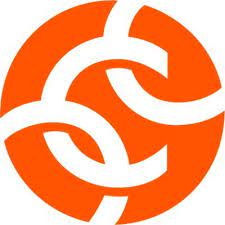

# *Deron Porter*
**RegTech-CaseStudy-Chainalysis**
# 

## Overview and Origin

* What is the name of the company?
Chainalyis is the RegTech company I wanted to look into with this case stduy. First a little background, what is RegTech? RegTech as investopedia, "is the management of regulatory processes within the financial industry through technology." This falling under the umbrella of one of the lastest web devolopements and inovation of FinTech. The company of Chainalysis designs and develops software that prevents, detects and investigates cryptocurrency money laundering, fraud and compliance violations.
2014 in the mist of a new era of cyrptotechnologies and cyber crimes related to such. They began with a major crypto case of the start of 2014 with MT. Gox and the error in their exchange which allowed a single user to make changes to the crypto Ledagar. 
They then sell this information and interpatation of this data to government regulatory agencies. Cofounders of Chainalysis are the current CEO and chief stragtegy officer. Michale Gronager, age 51, a PhD in quantum mechanics is the CEO of chainalysis. Jonathan Levin, age 32, current Dean of the Stanford Graduate School of Business is the chief strategy officer for Chainalysis.
The idea from this company came about from the need to help goverment agencies with the regulation of crypto currencies. By devoloping software and tools to help with tracking of illict money found within the cryptocurreny market. They state in their mision statement that, "We create transparency for a global economy built on blockchains, enabling banks, businesses, and governments to have a common understanding of how people use cryptocurrency."
Chainalysis was founded in 2014 and quickly began work with a $535 million funding from the Venture Capital firms Benchmark and Accel.

## Business Activities

Chainalysis is one of the largest RegTech compaines. They manage this by handling the 'back-end' work for government sercuity agencies by providing data, software, services, and research.   
The services provided by Chainalysis are primarly set-up so that they can work in conjuction with the Internal Revenue Service (IRS) and Department of the Treasury (USDT). In helping those agencies, and thier child agencies or international partners in the regulation of money in the United States. 
The major solution/product that Chainalysis offers is compliance Data and knowledge that can help users and operaters follow an ever inavative industry. This allows them to work when regulatory agencies need their services and help compaines follow compliance. Chainalysis Investigations Solutions are trusted globally by government agencies and private institutions to trace and understand blockchain activity. It powers investigators and analysts with real-time cryptocurrency intelligence, allowing them to map addresses to named services, detect illicit activity as it happens, and build cases.
DeFi, decentralizes transactions, intelligence and risk management tools. Provies also intelligence and risk management tools for NFTs. 
Big Data Machine Learning Blockcahin Cryptocurrency Cloud and IT security with software devoloped with Microsoft Visual Studio. 

## Landscape

* What domain of the financial industry is the company in?
Finace companies 

* What have been the major trends and innovations of this domain over the last 5–10 years?
Crypto and NTF uses to the consumer. 

* What are the other major companies in this domain?

## Results

* What has been the business impact of this company so far?
dao hack in 2016. at the time 3.64 million now 11 Billion 

* What are some of the core metrics that companies in this domain use to measure success? How is your company performing, based on these metrics?
Chainalysis core metric is Net Profit as they raise money from the value of the service they provide and can secure. In May of 2022 they were able to get $170 million in funding from a $8.6 Billion evaluation.

* How is your company performing relative to competitors in the same domain?
Chainalysis total funding $536.6 milion. ComplyAdvantage $108.2 million. Ascent 29.4 million. Forter 525M e-commers retail and tech. 

## Recommendations

* If you were to advise the company, what products or services would you suggest they offer? (This could be something that a competitor offers, or use your imagination!)
Greater expantion to e-commerse and regulation. 

* Why do you think that offering this product or service would benefit the company?
Larger and more consisant revune base.

* What technologies would this additional product or service utilize?
Working with a greater number exchanges.

* Why are these technologies appropriate for your solution?
More exchanges more data more currencies. 
 Sources:
 https://www.chainalysis.com/
 https://www.crunchbase.com/
 https://www.investopedia.com/terms/r/regtech.asp
 https://www.forbes.com/companies/chainalysis/?sh=6e79e8535e3b
 https://rise.barclays/success-stories/success-story--chainalysis0/
 https://techcrunch.com/2022/05/10/crypto-forensics-startup-chainalysis-raises-170m-at-8-6b-valuation/
 https://www.gemini.com/cryptopedia/the-dao-hack-makerdao#section-origins-of-the-dao
 https://www.forbes.com/sites/laurashin/2022/02/22/exclusive-austrian-programmer-and-ex-crypto-ceo-likely-stole-11-billion-of-ether/?sh=38bcaa097f58
